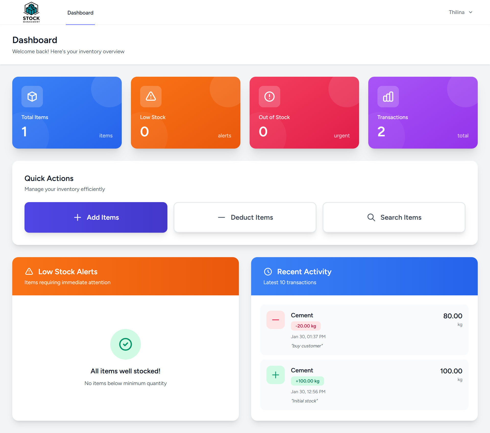
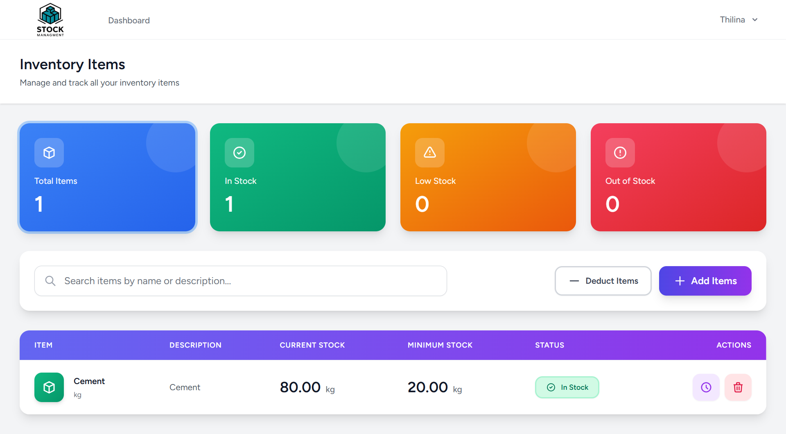
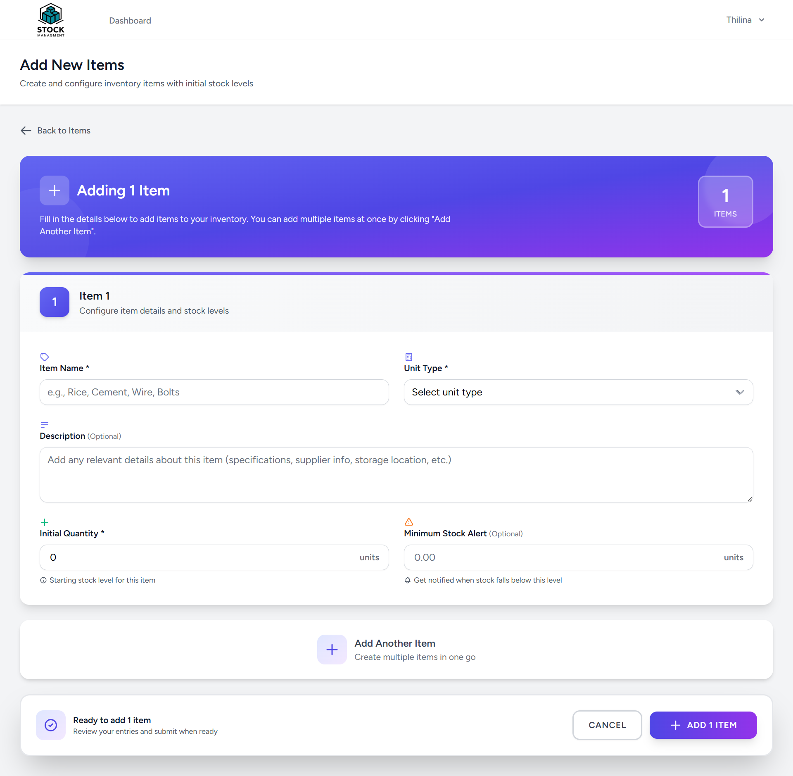
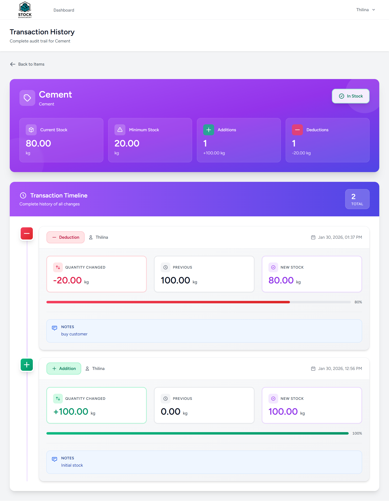

# 📦 Inventory Management System

A modern, full-featured inventory management application built with Laravel 12, Vue 3, and Inertia.js.


---

## ✨ Features

### Core Functionality
- ✅ **Add Items** - Add single or multiple items to inventory at once
- ✅ **Multiple Units** - Support for different measurement units (kg, m, cm, units)
- ✅ **Deduct Items** - Remove quantities from single or multiple items
- ✅ **Transaction History** - Complete audit trail of all additions and deductions
- ✅ **Search** - Real-time search with debouncing for quick item lookup
- ✅ **Stock Alerts** - Visual indicators for low stock and out-of-stock items

### UI/UX Features
- 🎨 Modern, clean interface with shadcn-vue components
- 📱 Fully responsive design (mobile, tablet, desktop)
- 🔍 Real-time search with 500ms debouncing
- 🎨 Color-coded stock status (Green/Orange/Red)
- 📊 Dashboard with statistics and recent activity
- 🔔 Toast notifications for user actions
- ✅ Form validation with clear error messages
- 🎯 Intuitive navigation and user flow

---

## 🛠️ Tech Stack

### Backend
- **Laravel 12.x** - PHP framework
- **MySQL** - Database
- **Laravel Breeze** - Authentication scaffolding
- **Inertia.js** - Server-side routing with SPA feel

### Frontend
- **Vue 3** - JavaScript framework (Composition API)
- **TypeScript** - Type safety
- **Tailwind CSS** - Utility-first CSS
- **shadcn-vue** - High-quality UI components
- **@vueuse/core** - Vue composition utilities

---

## 📋 Requirements

- PHP 8.2 or higher
- Composer
- Node.js 18+ and npm
- MySQL 8.0 or higher
- Git

---

## 🚀 Installation

### 1. Clone the Repository

```bash
git clone <your-repository-url>
cd inventory-management
```

### 2. Install PHP Dependencies

```bash
composer install
```

### 3. Install JavaScript Dependencies

```bash
npm install --legacy-peer-deps
```

### 4. Environment Configuration

```bash
# Copy environment file
cp .env.example .env

# Generate application key
php artisan key:generate
```

### 5. Database Setup

**Create MySQL Database:**

```sql
CREATE DATABASE inventory_management CHARACTER SET utf8mb4 COLLATE utf8mb4_unicode_ci;
```

**Configure `.env` file:**

```env
DB_CONNECTION=mysql
DB_HOST=127.0.0.1
DB_PORT=3306
DB_DATABASE=inventory_management
DB_USERNAME=your_username
DB_PASSWORD=your_password
```

### 6. Run Migrations

```bash
php artisan migrate
```

### 7. Start Development Servers

**Terminal 1 - Laravel:**
```bash
php artisan serve
```

**Terminal 2 - Vite:**
```bash
npm run dev
```

### 8. Access Application

Open your browser and visit: **http://localhost:8000**

---

## 📁 Project Structure

```
inventory-management/
├── app/
│   ├── Http/
│   │   ├── Controllers/
│   │   │   ├── DashboardController.php      # Dashboard stats
│   │   │   └── InventoryController.php      # Main CRUD operations
│   │   └── Requests/
│   │       ├── StoreInventoryRequest.php    # Add validation
│   │       └── DeductInventoryRequest.php   # Deduct validation
│   └── Models/
│       ├── Item.php                         # Item model
│       ├── InventoryTransaction.php         # Transaction model
│       └── User.php                         # User model
├── database/
│   └── migrations/
│       ├── create_items_table.php
│       └── create_inventory_transactions_table.php
├── resources/
│   └── js/
│       ├── Components/
│       │   └── Inventory/
│       │       ├── StockBadge.vue           # Stock status badge
│       │       ├── SearchBar.vue            # Search component
│       │       └── UnitSelect.vue           # Unit selector
│       ├── Pages/
│       │   ├── Dashboard.vue                # Main dashboard
│       │   └── Items/
│       │       ├── Index.vue                # Items list
│       │       ├── Create.vue               # Add items
│       │       ├── Deduct.vue               # Deduct items
│       │       └── History.vue              # Transaction history
│       └── types/
│           └── inventory.ts                 # TypeScript types
└── routes/
    └── web.php                              # Application routes
```

---

## 🗄️ Database Schema

### `items` Table
| Column | Type | Description |
|--------|------|-------------|
| id | bigint | Primary key |
| name | string | Item name (indexed for search) |
| description | text | Optional description |
| unit_type | enum | kg, m, cm, units |
| current_quantity | decimal(10,2) | Current stock level |
| minimum_quantity | decimal(10,2) | Reorder threshold |
| created_at | timestamp | Creation timestamp |
| updated_at | timestamp | Last update timestamp |
| deleted_at | timestamp | Soft delete timestamp |

### `inventory_transactions` Table
| Column | Type | Description |
|--------|------|-------------|
| id | bigint | Primary key |
| item_id | bigint | Foreign key to items |
| transaction_type | enum | addition, deduction |
| quantity | decimal(10,2) | Quantity changed |
| previous_quantity | decimal(10,2) | Stock before change |
| new_quantity | decimal(10,2) | Stock after change |
| notes | text | Optional notes |
| batch_id | string | Groups bulk operations |
| user_id | bigint | Foreign key to users |
| created_at | timestamp | Transaction timestamp |
| updated_at | timestamp | Last update timestamp |

---

## 🎯 Usage Guide

### Adding Items

1. Click **"Add Items"** button on Dashboard or Items page
2. Fill in item details:
   - Name (required)
   - Description (optional)
   - Unit type: kg, m, cm, or units (required)
   - Initial quantity (required)
   - Minimum quantity for alerts (optional)
3. Click **"Add Another Item"** to add multiple items at once
4. Click **"Add Items"** to save

### Deducting Items

1. Click **"Deduct Items"** button
2. Select items from dropdown
3. Enter quantity to deduct for each item
4. Add optional notes (e.g., "Production use", "Sale")
5. Click **"Deduct Items"** to process

### Viewing History

1. Go to Items list
2. Click the **clock icon** next to any item
3. View complete transaction timeline with:
   - Date and time
   - Addition or deduction
   - Quantity changes
   - Before/after stock levels
   - User who made the change
   - Notes

### Searching Items

- Use the search bar on Items page
- Results update automatically as you type
- Searches by item name

---

## 🔒 Security Features

- ✅ **Authentication Required** - All routes protected by auth middleware
- ✅ **CSRF Protection** - Laravel built-in CSRF tokens
- ✅ **SQL Injection Prevention** - Eloquent ORM with prepared statements
- ✅ **XSS Prevention** - Vue auto-escaping
- ✅ **Mass Assignment Protection** - Fillable properties in models
- ✅ **Input Validation** - Form Request validation
- ✅ **Stock Validation** - Cannot deduct more than available

---

## 🧪 Testing

### Manual Testing Checklist

- [ ] User can register and login
- [ ] Dashboard displays correct statistics
- [ ] Can add single item successfully
- [ ] Can add multiple items at once
- [ ] Search finds items by name
- [ ] Can deduct items with validation
- [ ] Cannot deduct more than available stock
- [ ] Transaction history shows all changes
- [ ] Stock badges show correct colors
- [ ] Low stock items appear in dashboard alert
- [ ] All forms validate properly
- [ ] Success/error messages display

### Run Tests (if implemented)

```bash
php artisan test
```

---

## 📊 Performance Optimizations

- ✅ Database indexes on searchable columns
- ✅ Pagination for large datasets (15 items per page)
- ✅ Debounced search (500ms delay)
- ✅ Eager loading relationships to prevent N+1 queries
- ✅ Query scopes for efficient filtering
- ✅ Asset optimization with Vite

---

## 🐛 Troubleshooting

### Common Issues

**"Class not found" errors:**
```bash
composer dump-autoload
```

**Routes not working:**
```bash
php artisan route:clear
php artisan config:clear
php artisan cache:clear
```

**Vite not building:**
```bash
rm -rf node_modules package-lock.json
npm install --legacy-peer-deps
npm run dev
```

**Database connection errors:**
- Check MySQL is running
- Verify `.env` database credentials
- Ensure database exists

---

## 🚢 Deployment

### Production Build

```bash
# Optimize Composer autoload
composer install --optimize-autoloader --no-dev

# Build frontend assets
npm run build

# Cache configuration
php artisan config:cache
php artisan route:cache
php artisan view:cache

# Run migrations on production
php artisan migrate --force
```

### Environment Variables

Update `.env` for production:

```env
APP_ENV=production
APP_DEBUG=false
APP_URL=https://yourdomain.com
```

---

## 📝 API Routes

| Method | URI | Name | Description |
|--------|-----|------|-------------|
| GET | /dashboard | dashboard | Dashboard with stats |
| GET | /items | items.index | List all items |
| GET | /items/create | items.create | Show add items form |
| POST | /items | items.store | Store new items |
| GET | /items/{item} | items.show | Show item details |
| DELETE | /items/{item} | items.destroy | Delete item |
| GET | /items/deduct/create | items.deduct.create | Show deduct form |
| POST | /items/deduct | items.deduct | Process deductions |
| GET | /items/{item}/history | items.history | View transaction history |

---

## 🤝 Contributing

This is a personal project for an internship assignment. If you'd like to suggest improvements:

1. Fork the repository
2. Create a feature branch (`git checkout -b feature/improvement`)
3. Commit your changes (`git commit -m 'Add improvement'`)
4. Push to the branch (`git push origin feature/improvement`)
5. Open a Pull Request

---

## 📄 License

This project is created as part of an internship assignment.

---

## 👨‍💻 Author

**Your Name**
- Email: thilina.bandara623@gmail.com
- GitHub: [@Thilina-Samarasinghe](https://github.com/Thilina-Samarasinghe)
- LinkedIn: [Thilina Samarasinghe](https://www.linkedin.com/in/thilina-samarasinghe-a82145279/)

---

## 🙏 Acknowledgments

- Laravel team for the amazing framework
- Vue.js team for the reactive framework
- shadcn-vue for beautiful UI components
- Tailwind CSS for utility-first styling
- Anthropic for assignment guidelines

---

## 📸 Screenshots

### Dashboard

*Main dashboard showing inventory overview and recent activity*

### Items List

*Complete list of inventory items with search and filters*

### Add Items

*Form for adding single or multiple items*

### Transaction History

*Complete audit trail of item transactions*

---

## 📞 Support

For issues or questions:
1. Check the [Troubleshooting](#-troubleshooting) section
2. Review [Laravel Documentation](https://laravel.com/docs)
3. Check [Vue.js Documentation](https://vuejs.org/)
4. Open an issue on GitHub

---

## 🔄 Version History

### v1.0.0 (Current)
- ✅ Initial release
- ✅ Complete CRUD operations for items
- ✅ Transaction tracking
- ✅ Search functionality
- ✅ Dashboard with statistics
- ✅ Responsive UI design

---

**Built with ❤️ for efficient inventory management**
